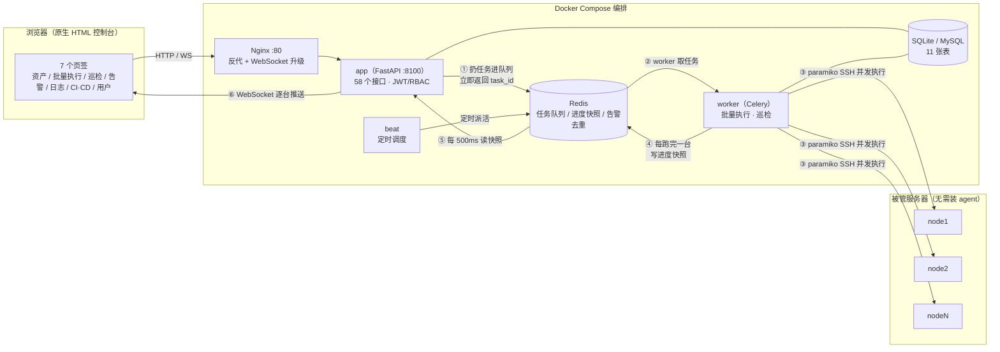

<div align="center">

# SmartOps Assistant

**轻量级智能运维平台 · Agentless（无代理）架构**

被管服务器**不需要安装任何 agent**，只要 SSH 可达即可纳管。


**实测**：创建任务接口 **49 ms** 返回，同一任务实跑 **8594 ms**（相差约 **175 倍**）·
纳管自建 3 节点 K8s 集群 · 巡检 18 项真实暴露磁盘 **84%** 超阈值 · 应用镜像 **376 MB**

</div>

---

## 目录

- [一、它解决什么问题](#一它解决什么问题)
- [二、技术栈与选型理由](#二技术栈与选型理由)
- [三、快速开始](#三快速开始)
- [四、功能模块](#四功能模块)
- [五、真实验证数据（不是模拟）](#五真实验证数据不是模拟)
- [六、测试过程中修掉的真实缺陷](#六测试过程中修掉的真实缺陷)
- [七、目录结构](#七目录结构)
- [八、API](#八api)
- [九、相关文档](#九相关文档)

---

## 一、它解决什么问题

| 传统做法 | 痛点 | 本平台的做法 |
|---|---|---|
| 一台一台 SSH 上去敲命令 | 50 台要敲 50 次，还容易漏 | Web 端多选 → 一次下发 → **WebSocket 实时回传每台结果** |
| 巡检靠人工看 `df`/`free` | 费时、判据不统一、没有留痕 | 模板化巡检 + 阈值判级 + **自动生成 HTML 报告** |
| 告警刷屏，没人看得过来 | 同一故障反复通知，值班被打爆 | **Redis 窗口去重** + 升级通知 + 多渠道推送 |
| 故障根因靠经验 | 新人上手慢 | **接入大模型输出根因与处置建议**（无 Key 自动降级规则库）|

---

## 二、技术栈与选型理由

| 层 | 选型 | 为什么是它 |
|---|---|---|
| Web 框架 | FastAPI | 异步、Pydantic 原生校验、自动生成 Swagger 文档 |
| 任务队列 | **Celery** | 批量操作/巡检是分钟级长任务，不能塞在 HTTP 请求里等（浏览器会超时、网关会 504） |
| 队列中间件 | **Redis** | 内存级原子弹出，天然适合「多 worker 抢任务」；同时兼做告警去重窗口与进度快照 |
| 实时推送 | **WebSocket** | worker 每跑完一台就推一条，页面不用刷新 |
| 数据库 | SQLAlchemy + SQLite / MySQL | 本地开发零依赖，生产切 MySQL 只改一个连接串 |
| 远程执行 | paramiko（线程池并发） | 同步阻塞库配线程模型最省心；限制最大并发防止把 sshd 打满 |
| 大模型 | OpenAI 兼容接口 | DeepSeek / 通义 / OpenAI 一套请求格式，靠 base_url + model 切换 |
| 报告 | Jinja2 | 生成自带样式的 HTML 报告 |
| 部署 | Docker Compose | nginx + app + worker + beat + redis 一键起（MySQL 可选），见「快速开始」|

### 请求是怎么走的



> 关键在**虚线那一段的实线回路**：worker 每跑完一台就把进度写进 Redis，
> app 每 500 ms 读一次快照推给浏览器，所以页面上的结果是**一条一条冒出来的**，
> 不是等全部跑完才一次性刷出。这也意味着 Redis 挂了还能退化成查数据库，页面不会白屏。

---

## 三、快速开始

### 方式 A：Docker Compose 一键起（推荐）

```bash
docker compose up -d --build
# 打开 http://localhost        （经 Nginx）
# 或   http://localhost:8100   （直连应用）
```

起来的是 5 个容器（第 6 个 MySQL 见下方说明）：

| 容器 | 作用 | 端口 |
|---|---|---|
| `smartops-nginx` | 反向代理（含 WebSocket 升级配置） | 80 |
| `smartops-app` | FastAPI Web 服务 | 8100 |
| `smartops-worker` | Celery 后台工人（批量执行 / 巡检真正干活的地方） | — |
| `smartops-beat` | 定时调度（每 6 小时自动巡检一轮） | — |
| `smartops-redis` | 任务队列 + 告警去重窗口 + 进度快照 | 6379 |
| `smartops-mysql` | 业务数据库（**可选**，默认走 SQLite） | 3306 |

两个设计要点：

- `app` / `worker` / `beat` **共用同一个镜像**，只是启动命令不同 —— 这就是"Web 立刻返回、任务后台跑"在部署层的落地
- `app` 和 `worker` 共用 `app-data` 卷 —— worker 生成的巡检报告，app 得能读到才能发给浏览器

**默认数据库是 SQLite**（零依赖、开箱即用）。要切 MySQL：

```bash
# 在 .env 里把 DATABASE_URL 指向 mysql，然后带上 profile
docker compose --profile mysql up -d
```

`docker compose down` 停止（数据保留在卷里）；`docker compose down -v` 连数据一起清空。

### 方式 B：本机直接跑（改代码时更快）

```bash
# 1. 建虚拟环境并装依赖
python -m venv venv
venv\Scripts\python.exe -m pip install -r requirements.txt

# 2. 复制配置（不配也能跑：数据库默认 SQLite，Redis 缺失自动降级）
copy .env.example .env

# 3. 启动 Web 服务
venv\Scripts\python.exe -m app.main
# 打开 http://127.0.0.1:8100
```

默认账号：`admin/admin123`（管理员）· `ops/ops123`（运维）· `viewer/view123`（只读）

**要看真正的异步效果，还得单独起一个 worker**（否则任务没人执行，会一直停在 pending）：

```bash
venv\Scripts\python.exe -m celery -A app.tasks.celery_app:celery_app worker -l info -P solo
```

> ⚠️ **Windows 上跑 worker 必须加 `-P solo`** —— Celery 默认的 prefork 池依赖 `fork`，Windows 没有这个系统调用。容器里（Linux）不用加。

**Redis 可选，但强烈建议起。** 缺 Redis 时 Celery 自动切到 `task_always_eager`（同步执行）：
功能完整、接口照样返回，但**失去异步性** —— 批量执行会变成"等所有机器跑完才一次性返回结果"，
中间过程看不到，页面也会一直转圈。日志里会**明确打印**这个切换，不会静默改变行为。


---

## 四、功能模块

### M1 资产管理
录入服务器（IP / SSH 端口 / 账号 / 密钥）→ 分组 / 环境 / 用途标注 → SSH 批量采集 OS、内核、CPU、内存、磁盘、uptime。
字段级变更留痕（谁、何时、把什么从什么改成了什么）。

### M2 批量执行（核心）
Web 端多选目标 → 下发命令或脚本 → Celery 异步执行 → **WebSocket 实时回传每台输出**。
含执行历史、按原参数重跑、**高危命令二次确认**（`rm -rf` / `mkfs` / `shutdown` 等命中后返回 428，必须显式确认）。

### M3 自动化巡检
六类内置检查项：磁盘使用率、内存使用率、CPU 负载、关键进程存活、端口监听、系统日志错误关键字。
一次 SSH 会话采集全部数据（不是每项开一次连接），按模板阈值判级 → 生成 **HTML 报告**（异常项高亮、可跳转修复）
→ 把异常清单交给大模型生成「整体结论 + 优先处理项」。

### M4 告警聚合
接收 Alertmanager Webhook → 归一化 → **Redis `SET NX EX` 去重窗口**（同主机 + 同告警 + 同指标 5 分钟内只通知一次）
→ 记录重复次数 → 超时未恢复标记升级 → 钉钉 / 飞书 / 企业微信通知 → AI 根因诊断回写。
提供「生成模拟告警」接口，本地没有 Prometheus 也能验证整条链路。

### M5 日志分析
三种取日志方式：上传文件 / **SFTP 从被管机拉取** / 直接贴文本。
- Nginx 访问日志：Top IP、慢请求（按 `$request_time`）、状态码分布、时间分布
- 通用日志：错误行统计 + **归一化指纹聚合**（抹掉时间戳、IP、PID、路径后再算指纹，把同一类错误合成一条）
- 可选：把日志片段交给大模型做根因分析

### M6 CI/CD 集成
GitLab 流水线查看与触发、Jenkins 作业状态与构建。**未配置凭据时整块能力优雅关闭**，不影响其它功能。

### M7 用户与权限
JWT 登录 + **RBAC 三级角色**（admin / ops / readonly），所有批量操作与资产变更写入审计日志。

---

## 五、真实验证数据（不是模拟）

在自建的 **3 节点 K8s 集群**（CentOS 7.9 / K8s v1.34.11 / containerd 1.6.33）上实测：

```
master  192.168.136.201   2核/3770MB   根盘 55%
node1   192.168.136.202   2核/3770MB   根盘 84%
node2   192.168.136.203   2核/3770MB   根盘 84%
```

- **资产管理**：3 台全部纳管，SSH 探测一次拿回 OS / 内核 / CPU / 内存 / 磁盘 / uptime
- **批量执行**：3 台并发执行，退出码全 0，实测耗时 1.4 ~ 2.2 秒/台
- **自动化巡检**：18 个检查项 → 13 正常 + **5 警告**（node1/node2 磁盘 84% 超 80% 阈值；三台系统日志错误 21 / 24 / 207 条）
- **告警聚合**：注入 4 条告警，去重与计数正常，AI 诊断覆盖 100%
- **日志分析**：120 行 Nginx 样本 → 解析出 Top IP、10 条慢请求、状态码分布 `{200:90, 502:10, 504:10, 500:10}`

### Celery 异步执行 + WebSocket 逐台刷新（真 Redis，非降级模式）

三台机器故意给不同耗时（master 2s / node1 4s / node2 6s），"逐台"才看得出来：

```
POST /api/executor/tasks   →   49 ms 返回（没有等任务跑完）
WebSocket 连接建立          →  +83 ms
+  83ms    status=pending      0/3
+ 584ms    status=running      0/3
+3585ms    推送 master        done 1/3
+6588ms    推送 node1         done 2/3
+8592ms    终态 success，带齐 3 条逐机明细
```

**接口 49 ms 返回，任务实跑 8594 ms —— 相差约 175 倍。** 这是"异步"最直白的证据：
接口没有被长任务拖住，结果是一条一条推到页面的。

### 容器化部署实测

```
docker compose up -d
smartops-app     healthy (8100)      smartops-redis   healthy (6379)
smartops-worker  healthy             smartops-beat    Up
smartops-nginx   Up      (80)        应用镜像          376 MB
```

- 容器内的平台能正常 SSH 到三台 K8s 节点：纳管 3 台、批量执行退出码全 0、巡检 18 项得 13 正常 / 5 警告
- worker 生成的巡检报告，app 能读到（`GET /api/inspection/runs/1/report` → HTTP 200 / 9199 字节）→ **共享卷设计成立**
- **WebSocket 经 Nginx 转发同样正常** → 验证了 `proxy_set_header Upgrade` / `Connection "upgrade"` 两行配置


---

## 六、测试过程中修掉的真实缺陷

1. **采集脚本退出码被"可选文件不存在"带偏** —— 脚本最后一条是 `[ -f /var/log/syslog ] && ...`，
   CentOS 7 上没这个文件，判断失败让整个脚本退出码变成 1，巡检被误判成「机器不可达」。
   → 脚本末尾补 `echo "###END"` 保证退出码，同时 `inspect_one` 改成「只要拿回分节数据就照常判级」。
2. **`printf` 末尾漏 `\n`** —— 下一节的 `###MEM` 被粘在上一行数据后面，导致内存、负载两项**根本没被解析**（显示 0.0%）。
   → 分节标记必须独占一行。
3. **规则库降级会「串味」** —— KubeletDown 告警因为上下文里提到了同主机的磁盘告警，被误判成「磁盘空间不足」。
   → 改为优先匹配本条告警自身字段，匹配不上再扫完整上下文。
4. **`run_parallel` 返回列表而不是生成器 → 「逐台刷新」根本是假的** ——
   它把结果先收成列表再返回，调用方要等**最后**一台跑完才开始逐条处理，`done=1` / `done=2`
   这些中间进度全挤在最后几毫秒发出去，前端看到的仍是「一下子全出来」；
   而且只要有一台卡住等超时，整批进度都停在 0，看不出到底跑到哪了。
   → 新增 `iter_parallel` 生成器（`as_completed` 里直接 `yield`），`run_parallel` 保留为它的薄封装。
   **实测对比：修复前只收到 1 条终态消息；修复后 master 在 +3585 ms、node1 在 +6588 ms 陆续到达。**
5. **终态快照不带逐机明细 → 最后一台的结果被冲掉** ——
   最后一台完成和「任务结束」很可能落在同一个 500 ms 轮询窗口里，终态覆盖掉 `latest` 之后，
   那台的明细就再也没送到前端。→ 终态 `_publish_progress` 带上完整 `results` 数组。
   （前端本来就在读 `d.results`，是后端从来没发过这个字段 —— 属于**前后端契约不一致**，只有真跑才暴得出来。）
6. **镜像里的 `HEALTHCHECK` 被套到了 worker / beat 上 → 永远 unhealthy** ——
   探针探的是 8100 的 HTTP 接口，而 worker 根本不监听端口。在生产编排里这会触发反复重启，
   **可能打断正在跑的批量任务**。
   → worker 覆盖成问 Celery 自己（`celery inspect ping -d celery@$HOSTNAME`），beat 直接 `healthcheck: disable`。

---

## 七、目录结构

```
smartops/
├── app/
│   ├── main.py                # FastAPI 入口 + 启动初始化
│   ├── config.py              # 配置中心（.env）
│   ├── db.py                  # SQLAlchemy 引擎与会话
│   ├── models/                # 11 张表的 ORM
│   ├── schemas/               # Pydantic 请求/响应模型
│   ├── routers/               # 8 个路由模块
│   ├── services/              # ssh_client / inspector / llm_client / alert_handler / log_parser / cicd_client
│   ├── tasks/                 # Celery：celery_app / batch_exec / inspection
│   ├── templates/report.html  # 巡检报告模板
│   └── utils/                 # security(JWT+RBAC) / redis_client / response
├── frontend/index.html        # 原生 HTML 单页控制台
├── deploy/nginx.conf          # 反向代理配置（含 WebSocket 升级头）
├── scripts/                   # 探测、冒烟测试、异步验证、真机演示脚本
├── data/reports/              # 生成的巡检报告
├── Dockerfile                 # 应用镜像（app / worker / beat 共用同一个）
├── docker-compose.yml         # 一键起 nginx + app + worker + beat + redis（+ 可选 mysql）
├── .dockerignore              # 排除 venv/ 与 data/：venv 是 Windows 二进制，拷进 Linux 镜像会坏
├── requirements.txt
└── .env.example
```

---

## 八、API

启动后访问 `/docs` 查看完整 Swagger 文档（58 个路由）。主要接口：

| 方法 | 路径 | 说明 |
|---|---|---|
| POST | `/api/auth/login` | 登录换取 JWT |
| GET/POST | `/api/assets` | 资产列表 / 录入 |
| POST | `/api/assets/{id}/probe` | SSH 探测单台 |
| POST | `/api/assets/probe/batch` | 批量并发探测 |
| POST | `/api/executor/tasks` | 创建批量执行任务 |
| WS | `/api/executor/ws/{task_id}` | 实时接收逐台执行结果 |
| POST | `/api/inspection/runs` | 发起巡检 |
| GET | `/api/inspection/runs/{id}/report` | 打开 HTML 报告 |
| POST | `/api/alerts/webhook` | 接收 Alertmanager 告警 |
| POST | `/api/alerts/mock` | 生成模拟告警（演示用）|
| POST | `/api/logs/remote` | 拉取远程日志并分析 |
| GET | `/api/dashboard/overview` | 首页总览 |

---

## 九、相关文档

| 文档 | 适合谁看 | 内容 |
|---|---|---|
| **[项目介绍.md](项目介绍.md)** | 想了解这个项目的人 | 按软件工程结构组织：需求分析 → 系统设计 → 技术选型 → 代码实现 → 测试验证 → 部署 → 项目亮点 |
| **[VSCODE部署教程.md](VSCODE部署教程.md)** | 要把它跑起来的人 | 12 步手把手，含 VS Code 断点调试（F5）配置与常见报错对照表 |
| **[代码导读.md](代码导读.md)** | **代码基础薄弱、想读懂源码的人** | 先讲读本项目够用的 7 个 Python 语法，再按「一个请求怎么走完全程」逐段带注释讲解 |

---

## License

本项目仅用于学习与技术展示，**未指定开源许可证**（如需二次使用请先联系作者）。
